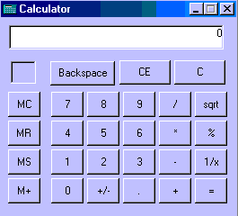



## A Standart Calculator

### Description

I did this project for my MCSD VB6 course.

It should behave exactly like Windows-Calculator.
 
### More Info
 

             |
---                |---
**Submitted On**   |2001-08-01 14:02:02
**By**             |[Yaniv Arazi](https://github.com/Planet-Source-Code/PSCIndex/blob/master/ByAuthor/yaniv-arazi.md)
**Level**          |Beginner
**User Rating**    |4.8 (24 globes from 5 users)
**Compatibility**  |VB 6\.0
**Category**       |[Math/ Dates](https://github.com/Planet-Source-Code/PSCIndex/blob/master/ByCategory/math-dates__1-37.md)
**World**          |[Visual Basic](https://github.com/Planet-Source-Code/PSCIndex/blob/master/ByWorld/visual-basic.md)
**Archive File**   |[A Standart24120852001\.zip](https://github.com/Planet-Source-Code/yaniv-arazi-a-standart-calculator__1-25568/archive/master.zip)

